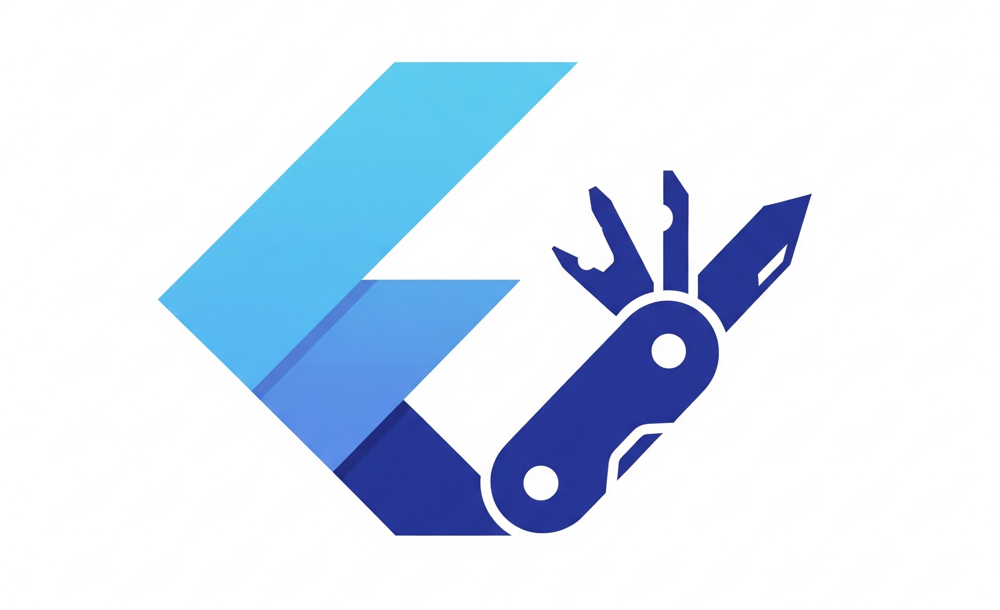

# Flutter Armyknife 🔧



**Flutter Armyknife** は、その名の通り「十徳ナイフ」のように小さな便利を提供する、Dart・Flutter 開発者向けのユーティリティライブラリ集である。

日常的な開発作業で遭遇する様々な課題を解決するため、軽量で使いやすい小さなライブラリを多数提供している。それぞれのライブラリは独立して使用でき、プロジェクトの要件に応じて必要なものだけを選択できる。

## 🌟 特徴

- **軽量設計**: 各ライブラリは必要最小限の機能に特化
- **型安全**: Dart の型システムを活用した安全なコード
- **独立性**: 各ライブラリは独立して使用可能
- **実用性**: 実際の開発現場で遭遇する課題に基づいて設計

## 📚 ライブラリ一覧

| カテゴリ | ライブラリ | 概要 | 主な機能 |
|---------|-----------|------|----------|
| 🔄 非同期処理・並行処理 | **[async_notify2](./async_notify2/)** | Java/Kotlin の notify/wait を再現 | 非同期処理の待ち合わせ、型安全な値の送受信 |
| 🔄 非同期処理・並行処理 | **[future_context2](./future_context2/)** | キャンセル可能な非同期処理 | 非同期処理のキャンセル、タイムアウト、階層管理 |
| 🔄 非同期処理・並行処理 | **[future_context2_hooks](./future_context2_hooks/)** | FutureContext Hooks 統合 | FutureContext の Flutter Hooks 統合、Widget ライフサイクル連携 |
| 🔄 非同期処理・並行処理 | **[task_queue](./task_queue/)** | 順序付きタスク実行システム | タスクの順番保証、同期的な実行制御 |
| 🏗️ データ処理・変換 | **[dartx](./dartx/)** | Dart 基本機能の拡張 | Iterable 拡張、型判定、コレクション構築 |
| 🏗️ データ処理・変換 | **[streams](./streams/)** | RxDart ベースの Stream 操作 | Stream 結合、生成型 Stream、Future-Stream 変換 |
| 🏗️ データ処理・変換 | **[yamlx](./yamlx/)** | YAML ファイル処理 | YAML の Map 変換、マージ機能、パス指定取得 |
| 🗄️ データベース・永続化 | **[driftx](./driftx/)** | Drift データベース拡張 | SQLite 結果コード、複数データベース同時トランザクション |
| 🎯 状態管理 | **[flutter_riverpod_watch_plus](./flutter_riverpod_watch_plus/)** | Riverpod watch() の拡張ライブラリ | Collection ディープイコール対応、不要な再描画防止 |
| 🎯 状態管理 | **[riverpodx](./riverpodx/)** | Riverpod サポートライブラリ | ProviderContainer 構築、Stream フック、リスト型プロパティ |
| 🎯 状態管理 | **[riverpod_container_async](./riverpod_container_async/)** | ProviderContainer 非同期サポート | 非同期初期化・削除処理、タスクキュー管理 |
| 🎯 状態管理 | **[state_stream](./state_stream/)** | 軽量状態管理 | 型安全な状態管理、リアクティブ更新、スレッドセーフ |
| 🎯 状態管理 | **[state_stream_riverpod](./state_stream_riverpod/)** | state_stream の Riverpod 連携 | Riverpod プロバイダーとの統合 |
| 🧪 テスト支援 | **[flutter_testx](./flutter_testx/)** | Flutter Test 拡張 | 型検証とキャスト、型安全なアサーション |
| 🧪 テスト支援 | **[test_context](./test_context/)** | テスト用コンテキスト | テスト毎のインスタンス保証、自動クリーンアップ |
| 🧪 テスト支援 | **[riverpod_container_async_test](./riverpod_container_async_test/)** | riverpod_container_async のテストサポート | riverpod_container_async のテスト機能 |
| 🔧 Flutter 拡張 | **[flutterx](./flutterx/)** | Flutter SDK 拡張 | テスト環境判定、フレーム同期待機 |
| 📝 ログ・デバッグ | **[logger](./logger/)** | ログライブラリ統一インターフェース | 4 つのログレベル、プラットフォーム非依存 |
| 📝 ログ・デバッグ | **[logger_flutter](./logger_flutter/)** | Flutter 用ログ実装 | Flutter アプリケーション向けログ出力 |
| 📝 ログ・デバッグ | **[logger_grinder](./logger_grinder/)** | Grinder 用ログ実装 | ビルドツール向けログ出力 |
| ⚡ エラーハンドリング | **[exceptions](./exceptions/)** | 例外トレース機能 | 例外のアンラップ、例外チェーン検索、カスタムアンラッパー |
| ⏰ 時刻処理 | **[time](./time/)** | 軽量時刻処理 | time_machine ラッパー、Clock デリゲート、Unix エポック |

## 🚀 使用開始

各ライブラリは独立して使用できる。必要なライブラリを `pubspec.yaml` に追加して使用する：

```yaml
dependencies:
  armyknife_dartx: ^1.0.0
  armyknife_future_context2: ^1.0.1
  armyknife_riverpodx: ^1.0.0
  flutter_riverpod_watch_plus: ^1.0.0
  # 他の必要なライブラリ
```

## 📖 ドキュメント

各ライブラリの詳細な使用方法は、それぞれのディレクトリ内の README.md を参照してください。

## 🤝 貢献

このプロジェクトは [flutter_armyknife](https://github.com/eaglesakura/flutter_armyknife) で管理されている。

- **バグ報告**: [GitHub Issues](https://github.com/eaglesakura/flutter_armyknife/issues)
- **機能要求**: [GitHub Issues](https://github.com/eaglesakura/flutter_armyknife/issues)
- **プルリクエスト**: 歓迎

## 📄 ライセンス

MIT License

---

> 🔧 **Armyknife** - 小さな便利を、いつでも手の届く場所に。
